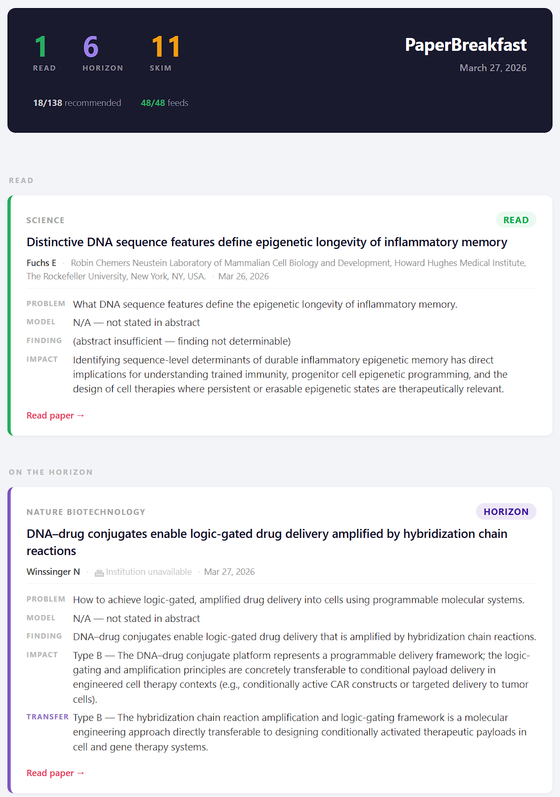

# PaperBreakfast

A self-hosted daily literature digest for researchers. PaperBreakfast polls RSS feeds from scientific journals, evaluates paper abstracts against your interest profile using an LLM, and delivers a ranked HTML email each morning — same day papers go online.

---

## Why

Keeping up with 48 journals is a daily time tax. PaperBreakfast replaces that with a single email containing only the papers that cleared the bar — ranked, summarized, and explained.

Each paper is evaluated against a richly described interest profile you write once. The LLM classifies every abstract into one of four triage labels and writes a structured four-field summary (Problem / Model / Finding / Impact). The daily email groups papers into three sections — **Read**, **On the Horizon**, and **Skim** — so you know immediately where to spend your attention.

The system runs entirely on your own machine. No subscription, no hosted service. API cost with Claude Sonnet is approximately $1–3/month.

---

## How it works

```
RSS feeds — polled once daily via feedparser
    ↓
SQLite — deduplicated by GUID, enriched with DOI / PI / institution via Crossref + PubMed
    ↓
Evaluator — modular backend × strategy design
    │  Backends:   Claude API | LM Studio | Ollama | Keyword (no LLM)
    │  Strategies: relevance_json | chain_of_thought
    │  Triage:     read | horizon | skim | skip
    ↓
Daily HTML email digest — Read → On the Horizon → Skim
```

Backends and strategies are fully independent axes. Swap either in `config.yaml` with no code changes. Adding a new backend or strategy requires one new file and one line in `factory.py`.

---

## Example digest

[](docs/examples/digest.html)

*March 27, 2026 — 1 Read · 6 Horizon · 11 Skim from 138 papers across 48/48 feeds. [View full HTML](docs/examples/digest.html)*

### Honest uncertainty — no hallucination

When a journal publishes a paper before the full text is available, the abstract often omits the model system used or withholds the key finding. The evaluator is explicitly instructed never to infer or guess these fields. Instead it uses two sentinel phrases that appear verbatim in the digest:

| Field | What you see | What it means |
|---|---|---|
| **Model** | `N/A — not stated in abstract` | No experimental model was described in the abstract |
| **Finding** | `(abstract insufficient — finding not determinable)` | The abstract announced the paper's existence without disclosing the result |

Both are visible in the Read card above (Fuchs lab, *Science*, March 26). The evaluator still classified the paper as **read** and wrote a full Impact field — because relevance can be judged from the problem and the lab, even when the finding is paywalled. Only the fields that would require fabrication are left blank.

This matters because summary fields that silently hallucinate erode trust in the tool over time. A sentinel phrase you can spot immediately is more useful than a plausible-sounding lie.

---

## Requirements

- Python 3.10+
- Gmail account (or any SMTP server) for email delivery
- One of:
  - Anthropic API key for the `claude` backend (recommended)
  - A running local LLM server for the `openai_compat` backend (LM Studio, Ollama, vLLM)
  - Neither, if starting with the `keyword` backend for testing

---

## Setup

### 1. Install

```bash
git clone https://github.com/WillingCareGroup/PaperBreakfast.git
cd PaperBreakfast

python -m venv .venv
.venv\Scripts\activate          # Windows
# source .venv/bin/activate     # macOS / Linux

pip install -e .
```

### 2. Configure

```bash
cp config.example.yaml config.yaml
cp .env.example .env
```

Edit `config.yaml`. At minimum, fill in the email section:

```yaml
email:
  smtp_host: smtp.gmail.com
  smtp_port: 587
  smtp_user: youraddress@gmail.com
  from_addr: youraddress@gmail.com
  to_addrs:
    - you@wherever.com
  send_hour: 8          # UTC hour to send the daily digest
```

### 3. Gmail App Password

Gmail requires an App Password for SMTP — your regular account password will not work.

1. Go to [myaccount.google.com](https://myaccount.google.com) → **Security**
2. **2-Step Verification** must be enabled
3. Search **"App passwords"** → create one → name it "PaperBreakfast"
4. Add the 16-character password to `.env`:

```
SMTP_PASSWORD=abcd efgh ijkl mnop
```

### 4. Write your interest profile

Edit `profile.md`. This is the most important configuration in the system — the LLM evaluates every abstract against it verbatim. See **[Writing your interest profile](#writing-your-interest-profile)** below for a full guide. The `profile.md` included in this repository is a complete, production-quality example.

### 5. Verify your setup

```bash
python main.py feeds          # list configured feeds and their status
python main.py fetch          # poll all feeds and evaluate new papers
python main.py status         # show database statistics
python main.py digest         # send a test digest to your inbox immediately
```

Check your inbox (and spam folder on the first send).

### 6. Benchmark the evaluator

```bash
python main.py eval
```

Runs 15 hand-labeled papers through the configured evaluator and reports precision, recall, and F1 against ground truth. Use this as your baseline before making any changes.

### 7. Switch to Claude API (recommended)

Add your API key to `.env`:

```
ANTHROPIC_API_KEY=sk-ant-...
```

Update `config.yaml`:

```yaml
evaluator:
  backend:
    type: claude
    model: claude-sonnet-4-6
    temperature: 0.0
  strategy:
    type: relevance_json
```

Re-run `python main.py eval` to confirm quality improvement over the keyword baseline.

### 8. Local LLM (LM Studio / Ollama)

```yaml
evaluator:
  backend:
    type: openai_compat
    model: your-model-name
    base_url: http://localhost:1234/v1    # LM Studio default
    # base_url: http://localhost:11434/v1 # Ollama default
```

### 9. Start the scheduler

```bash
python main.py run
```

Runs the full pipeline (fetch + evaluate + enrich + digest) once daily at the `send_hour` configured in `config.yaml` (UTC).

**Windows Task Scheduler** — for unattended daily runs on Windows, create a scheduled task pointing at `run_digest.bat`. This runs `python main.py run-once` (full pipeline: fetch + evaluate + enrich + digest) and logs output to `logs/scheduler.log`. In the task properties, set it to run **whether or not the user is logged on** — otherwise the task will silently skip when your session is locked.

---

## Writing your interest profile

The interest profile (`profile.md`) is the primary lever for relevance quality. It is passed verbatim to the LLM alongside each paper abstract. A well-written profile produces precise triage; a vague one produces noise.

### Profile structure

A profile has three sections:

---

**Background and Expertise**

Describe your scientific background, primary experimental systems, and career arc. This does two things: it tells the LLM what you already know deeply (so it does not over-recommend foundational or incremental work), and it calibrates the `horizon` label — papers that represent meaningful advances *beyond* your current knowledge base.

Be specific. "hematology researcher" produces worse results than describing the actual experimental systems you have run and the biology you have worked with first-hand.

---

**Scientific Interests**

Describe each area you want covered as a named subsection. For each area:

- State the **scope broadly** — include adjacent questions, underlying mechanisms, and enabling technologies you care about, not just the narrow application you work on directly
- Explain *why* it matters to you — this helps the LLM distinguish papers you would act on from papers that merely touch the topic
- If useful, state what you are **not** looking for in this area (e.g., "mouse-only studies without translational context", "review articles")

---

**Baseline Knowledge**

List the concepts, methods, and systems you already understand at a working or deep level. This is the single most important section for controlling false positives: the LLM uses it to determine whether a paper is genuinely new to you or merely a competent execution of something you already know well.

---

### The four triage labels

| Label | Meaning | What drives it |
|---|---|---|
| **read** | High priority — directly in your focus area | Strong overlap with a named interest at your working level |
| **horizon** | Broad breakthrough or meaningful cross-domain transfer | Novel relative to your baseline knowledge; could change how you think |
| **skim** | Tangentially relevant | Touches your area but outside your immediate focus or below your threshold |
| **skip** | Not relevant | No meaningful overlap with your profile |

The `horizon` label is particularly sensitive to the Baseline Knowledge section. Papers covering concepts you already know deeply are rarely labelled `horizon`, even if technically impressive. Papers that introduce a genuinely new approach, model system, or finding that intersects your work from an unexpected direction are the target.

### Practical tips

- **Write for an expert reader who doesn't know your subfield.** The LLM needs enough context to understand what distinguishes an important paper from a routine one in your area — "novel" means different things in different fields.
- **Use specific terminology.** "HSC expansion" outperforms "stem cell biology." "CAR-NK cell manufacturing" outperforms "cell therapy."
- **Cover adjacent fields deliberately.** If AI-guided protein design is relevant to your work, say so explicitly — the LLM will not infer it from a cell biology profile alone.
- **Update it when your interests shift.** Re-run `python main.py eval` after a significant profile update to verify triage quality on your labeled ground truth.
- **The example in this repo is production-quality.** The `profile.md` file included here was written for an active researcher in hematopoietic cell therapy and computational biology and has been tuned through weeks of live digests. Read it before writing your own.

---

## CLI reference

| Command | Description |
|---|---|
| `python main.py run` | Start the scheduler daemon |
| `python main.py run-once` | Run full pipeline once (fetch + evaluate + enrich + digest) |
| `python main.py fetch` | Run one poll + evaluate cycle immediately |
| `python main.py digest` | Send digest immediately |
| `python main.py status` | Show database statistics |
| `python main.py feeds` | List configured feeds and their status |
| `python main.py eval` | Benchmark evaluator against labeled ground truth |
| `python main.py feedback` | Show recent evaluated papers with triage labels |
| `python main.py feedback <guid> good\|noise\|missed` | Record relevance feedback on a paper |

All commands accept `--verbose` / `-v` for debug logging.

---

## Feeds

The `feeds.yaml` file contains 48 pre-configured feeds across Cell Press, Nature, Science, ASH, AACR, JAMA, Lancet, Wiley, and others, with documented workarounds for publishers that block direct RSS (PubMed mirror feeds, ScienceDirect ISSN feeds, Springer search feeds).

Add your own feeds:

```yaml
- url: https://www.cell.com/cell-stem-cell/inpress.rss
  name: Cell Stem Cell
  group: cell-press
  enabled: true
```

Set `enabled: false` to pause a feed without removing it.

---

## Evaluator backends and strategies

| Backend | Requires | Notes |
|---|---|---|
| `claude` | `ANTHROPIC_API_KEY` | Best quality; ~$1–3/month at Sonnet rates with chunked evaluation |
| `openai_compat` | Local LLM server | LM Studio, Ollama, vLLM — any OpenAI-compatible endpoint |
| `keyword` | Nothing | Rule-based; useful for testing with no API dependency |

| Strategy | Output | Notes |
|---|---|---|
| `relevance_json` | `triage`, `milestone` flag, structured `summary` | Default — four-field summary per paper (Problem / Model / Finding / Impact) |
| `chain_of_thought` | Step-by-step reasoning → score | For diagnosing evaluation behavior; legacy |

Evaluation runs in chunks of 10 papers per LLM call (configurable via `chunk_size`) to minimize API cost.

---

## Ground truth and feedback

The `eval/ground_truth.jsonl` file contains 15 hand-labeled papers covering the full relevance spectrum, from core focus areas to completely unrelated fields. Use the feedback command to grow it organically as real papers come in:

```bash
python main.py feedback                            # browse recent papers
python main.py feedback <guid> good|noise|missed   # label a paper
```

The more labeled examples you accumulate, the more statistically meaningful the benchmark becomes.

---

## Benchmarks

Results on the 15-paper hand-labeled ground truth set, covering the full relevance spectrum from core focus areas to unrelated fields.

### Evaluator comparison

| Backend | Precision | Recall | F1 | Notes |
|---|---|---|---|---|
| Keyword (baseline) | 100% | 22% | 36% | No LLM; conservative by design |
| Claude 3 Haiku | 75.0% | 100% | 85.7% | Systematic overscoring bias |
| Claude Haiku 4.5 | 81.8% | 100% | 90.0% | Initial production model |
| Claude Sonnet 4.6 | — | — | — | Current model; not yet benchmarked on this set |

Claude 3 Haiku scored nearly everything 0.80–0.90 regardless of true relevance and produced generic reasoning. Haiku 4.5 eliminated that bias with no recall loss. The system was subsequently upgraded to Sonnet 4.6 for improved triage judgment and structured summary quality.

### Evaluation efficiency

Chunked evaluation (25 papers per LLM call, the default) reduced API overhead by ~96% compared to per-paper calls:

| Mode | Calls for 833 papers | Relative cost |
|---|---|---|
| Per-paper | 833 | 1× |
| Chunked (chunk_size=25) | 34 | ~0.04× |

`chunk_size` is configurable in `config.yaml`. Smaller values (e.g. 10) improve parse reliability at slightly higher cost; larger values reduce cost further but increase the blast radius of a single malformed response.

### Enrichment coverage

Of 61 recommended papers in an early production run, 58 (95%) received real PI name and institution data from Crossref + PubMed enrichment. The 3 misses were papers without a resolvable DOI.

---

## Developer documentation

The following files give contributors full context on the project's architecture, constraints, and history. They are maintained as living documents alongside the code.

| File | Purpose |
|---|---|
| `docs/devlog.md` | Full decision log — every significant architectural choice with rationale, trade-offs, and pitfalls |
| `docs/invariants.md` | Hard architectural constraints that must not be violated |
| `CLAUDE.md` | Developer guidelines and AI pair-programming instructions for Claude Code |
| `HANDOFF.md` | Current project state, open questions, and recommended next steps — auto-maintained each session |

### Extending the evaluator

Adding a new backend:
1. Create `paperbreakfast/evaluators/backends/yourbackend.py` implementing `LLMBackend`
2. Register it in `paperbreakfast/evaluators/factory.py`

Adding a new strategy:
1. Create `paperbreakfast/evaluators/strategies/yourstrategy.py` implementing `EvaluationStrategy`
2. Register it in `paperbreakfast/evaluators/factory.py`

Backends and strategies must remain fully independent — see `docs/invariants.md` for the complete contract.

### Slash commands (Claude Code)

| Command | Action |
|---|---|
| `/adr <decision>` | Append a structured Architecture Decision Record to `docs/devlog.md` |
| `/log <note>` | Append a quick entry (pitfall, fix, discovery) to `docs/devlog.md` |
| `/handoff` | Rewrite `HANDOFF.md` to reflect current session state |

---

## License

MIT
